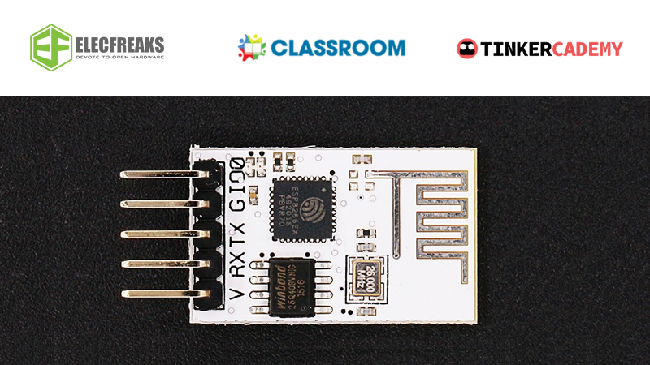
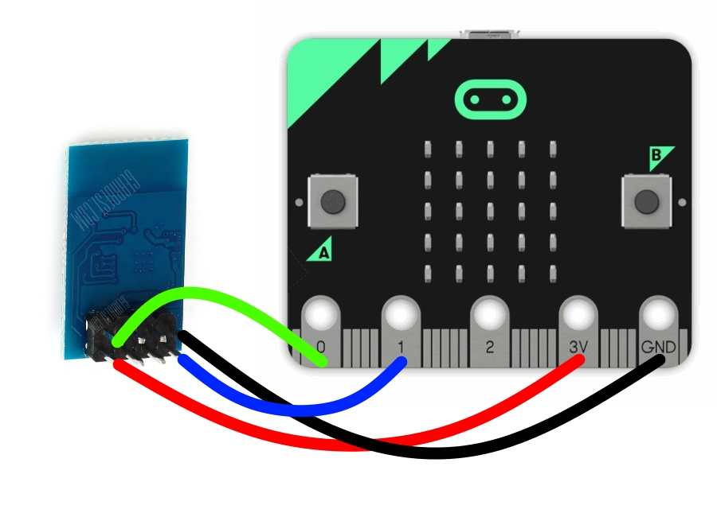

# Microbit Wifi Package for ESP8266 module

Microbit Makecode extension to allow the microbit to use the ESP8266's wifi connection abilities.

## Introduction

ESP8266 is an [~$5 wifi module](https://www.elecfreaks.com/estore/esp8266-serial-wifi-module.html), used in many tinkering projects to provide wifi to controller boards. This specific package is meant for [Microsoft's PXT for Micro:bit](https://makecode.microbit.org/) and comes with a good range of custom blocks to make your life easier, especially since there currently is little Micro:bit support for the ESP8266.

It features fairly well-laid foundational code, built on different transport layers with different protocols to maximize the potential of this cheap but powerful Wifi module. The user can have precise control via the [command system](command_queue.ts), and on a higher level, good HTTP support with the [request system](request_queue.ts). 

So what are you waiting for? Dive right in!

## Setup

1. Unlike the picture in the introduction, most ESP8266 modules come with 8 pins. Follow the above image when connecting to the Micro:bit. It is much easier to use a [breakout board](https://tinkercademy.com/tutorials/microbit-breakout-board/) however.
    - During my testing I found USB power wasn't enough to power the ESP8266 module. You should plug in a battery as well.
2. If using <a href="http://makecode.microbit.org/beta">Micro:bit Makecode beta</a>, simply sign into Github on it after forking the package and you will be able to use it straight away.
3. Else, follow the instructions <a href="https://makecode.microbit.org/offline">here</a>. Afterwards, clone the package and drop the contents into your project folder.
4. Lastly, official documentation of the ESP8266, including the list of commands, can be found [here](https://www.espressif.com/en/support/download/documents?keys=&field_type_tid%5B%5D=14).

## Documentation
Most, if not all, of the package contents are annotated with JSDocs. The Makecode IDE will automatically give hints based on that. In [main.ts](main.ts) you will find a test example too.

**DO NOTE: Both this version and the original package use the Serial package to communicate to the ESP8266, meaning you cannot use the Serial package at the same time to communicate to your computer or other devices. I am working on a way to change that but it might be a while.**

## Changelog
**I uploaded the package as soon as my test case worked using my framework so not everything here may be accurate.**

### Command System
Commands are sent to the ESP8266 over Serial and often are hard to handle. This [system](command_queue.ts) is meant to simpify the process.
* Created the Command object for this system, which allows blacklisting and whitelisting replies, giving commands a timeout, seeing rejected replies and more. Go to [command_queue.ts](command_queue.ts) to see how it works.
* Instead of fixed delays, reply from ESP8266 is used to determine when next command can be sent saving much time.
* A queue system is used to make sure commands are sent to the module one by one. Below are the three insertion functions:
  * `waitfor(cmd:string):string` blocks till the module replies to the command.
  * `command(cmd:string):void` sends a command and forgets about it.
  * `request(cmd:string):number` sends a command and returns an ID that can be used to find it via `retrieve(id:number)` or `check(id:number)`.

### Request System
* All HTTP methods are supported.
* 4 simultaneous requests are possible (4 queues).
  * Currently however requests are put into the shortest queue.
* Similar to Command System in how to make requests and how they are cleared, just on a higher layer.
* Responses are forwarded to the Requests that made them.

### Minor
* Allowed user to change wifi mode (client,hotspot both) for ESP8266. Created `enum wifiMode` for it.
* Allowed for multiple simultanous connections. Created `enum connectionSlot` for it.
* The enums were mainly created for readability. They can be found at [enums.ts](enums.ts).
* Came up with a way to debug it. (Involves two Microbits and the Radio package)
* Split code into multiple files for neatness.
* JSDocs (not Javadocs) and comments, everywhere.
* The syntax for the GET request in the original ESP8266 package was wrong. Fixed that.
* Found there was no need to restart the module during initialization. Removed that due to being time-consuming.
* Fixed `retrieve(id:number)` and `check(id:number)`.
* Message from ESP8266 about connections being closed now used to keep connection slots available better updated.
* Moved pictures into /pics.

## Plans
1. Bug testing, especially in regards to the different request types.
2. Firmware compatibility testing. The commands I used should work across all versions but for your reference, I am using [ai-thinker-0.9.5.2-9600.bin](http://wiki.aprbrother.com/en/Firmware_For_ESP8266.html). 
    * Here is a [tutorial](https://nodemcu.readthedocs.io/en/latest/en/flash/) on how to flash the ESP8266 module.
3. User-specified headers for requests.
4. Bring in some form of JSON to handle more forms of data for requests.
5. Decide if commands should be repeated till successful (like requests right now).
6. Generate proper documentations and a Github wiki page.
7. Expose uBit.serial so as to have multiple serial streams and not block serial when using package.
8. Expose hotspot mode with functions.
9. Figure out how to use the UDP protocol.
10. Have a server mode.
11. Have a mesh network mode.

## Credits
The [original ESP8266 package](https://github.com/elecfreaks/pxt-esp8266iot) was developed under the cooperation of [ElecFreaks](https://www.elecfreaks.com/), [Classroom](http://www.classroom.com.hk/) and [Tinkeracademy](https://tinkercademy.com/). 

This package was made by [Interpause@Github](https://github.com/Interpause) while interning at Tinkercademy when tasked to improve the original. The package ended up being a complete rewrite however.

I am really thankful to my mentor and my colleagues at TinkerTanker for being accommodating, and occasionally helping with debugging when I got stuck, as well as providing the Micro:bits and ESP8266 module required to develop this package.

## Archive note

In retrospect, my code for this project, while well planned, was also overkill. Nonetheless, this is some of my best work yet (being still quite young) and demonstrates me trying my best. The code is well annotated and organized even by my standards today. Unfortunately, I will be archiving this repository as I don't intend to work on it any further, though if I do happen to work with micro:bits in the future, perhaps I will unarchive and implement the rest of what I planned.
